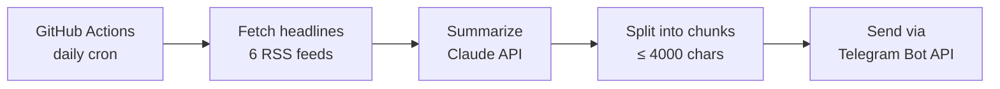

# AI-Powered Daily News Bot

A Python bot that sends me a daily news briefing on Telegram. Every morning it pulls the latest headlines from six RSS feeds, has Claude summarize them into short, focused sections, and delivers the result to Telegram. It runs entirely on GitHub Actions, so there is no server to maintain.

## How it works



1. **Fetch:** `feedparser` reads up to 15 headlines per topic from the RSS sources.
2. **Summarize:** the headlines go to Claude (Haiku 4.5) with a prompt that says what to focus on and what to ignore for each topic, for example central-bank decisions but not routine market noise.
3. **Deliver:** Telegram limits the length of a message, so the summary is split on paragraph boundaries into chunks under 4,000 characters. Each chunk is then sent through the Telegram Bot API.

## Topics covered

| Topic | Source |
|---|---|
| Global Economy & Markets | CNBC |
| World Politics | BBC News |
| Crypto | Cointelegraph |
| Artificial Intelligence | TechCrunch (AI) |
| Technology | TechCrunch |
| Israel News | The Times of Israel |

## Project structure

```
├── daily_updates.py          # fetch → summarize → send pipeline
├── requirements.txt          # requests, feedparser, anthropic
└── .github/workflows/
    └── daily.yml             # scheduled GitHub Actions job
```

## Tech stack

- **Python 3.12**
- **feedparser** reads the RSS feeds
- **Anthropic API** (Claude) does the summarization
- **requests** calls the Telegram Bot API
- **GitHub Actions** runs the job on a schedule, with secrets stored in GitHub Secrets

## Setup

### Run on GitHub Actions (recommended)

1. Fork or clone this repository.
2. Go to **Settings → Secrets and variables → Actions** and add these secrets:
   - `BOT_TOKEN`: your Telegram bot token (from [@BotFather](https://t.me/BotFather))
   - `CHAT_ID`: the Telegram chat ID the digest is sent to
   - `ANTHROPIC_API_KEY`: your Anthropic API key
3. The workflow runs daily at 04:00 UTC. You can also start it manually from the **Actions** tab (**Run workflow**).

### Run locally

```bash
pip install -r requirements.txt

export BOT_TOKEN="..."
export CHAT_ID="..."
export ANTHROPIC_API_KEY="..."

python daily_updates.py
```

## Security

The code contains no credentials. The bot reads every key from environment variables, and GitHub Actions fills those in from encrypted repository secrets. `.env` files are also listed in `.gitignore`.
